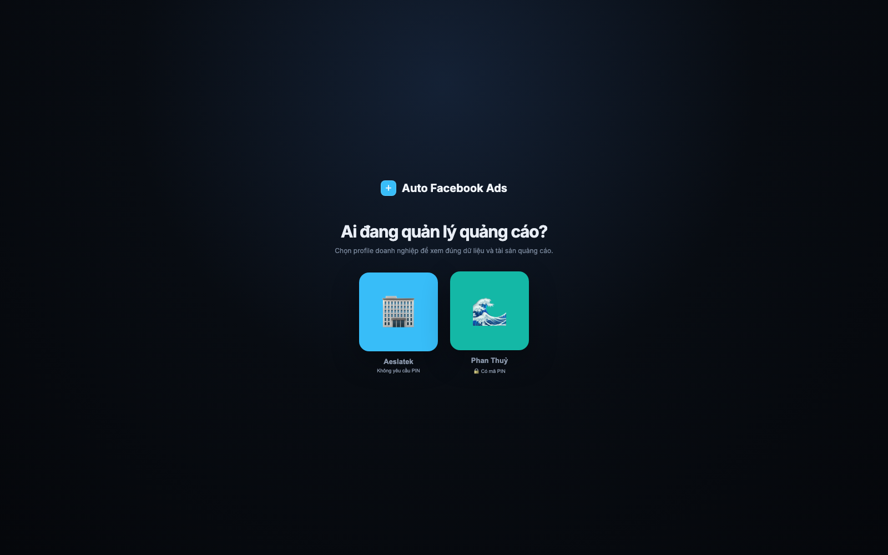

# Auto Facebook Ads

Dashboard quản trị và tối ưu Facebook Ads cho nhiều doanh nghiệp/profile. Hệ thống đồng bộ dữ liệu từ Meta vào SQLite, theo dõi toàn phễu quảng cáo, đưa ra quyết định bằng rule có thể kiểm chứng và dùng LLM để giải thích nguyên nhân, creative và tệp khách hàng.

> Trạng thái: đang phát triển nội bộ. Các thao tác thay đổi ngân sách/tắt quảng cáo là thao tác thật trên Meta khi cấu hình token có quyền phù hợp.

## Giao diện thực tế

### Chọn profile doanh nghiệp

Mỗi doanh nghiệp có dữ liệu, tài khoản quảng cáo, target, rule phân loại, lịch sử LLM, cron và backfill riêng. Profile nhạy cảm có thể được bảo vệ bằng PIN.



Sau khi chọn profile, ứng dụng cung cấp các khu vực chính:

- **Dashboard Analytics:** tình trạng vận hành, KPI hôm nay, sức khỏe dịch vụ, pacing ngân sách và việc cần xử lý.
- **Ad Library:** quản lý từng quảng cáo theo 7 ngày, 30 ngày hoặc toàn bộ lịch sử đã đồng bộ.
- **AI Optimizer:** phân tích xu hướng, quảng cáo tốt/xấu, creative, CTA, offer và tệp khách hàng.
- **Báo cáo hiệu suất:** tổng hợp theo dịch vụ, người chạy và profile.
- **Cấu hình báo cáo:** target CPMess/CPL/CPP, ngân sách, volume và quy tắc nhận diện tên quảng cáo.
- **Settings:** kết nối Meta Page/Ad Account và quản lý thông tin tích hợp.

## Điểm nổi bật

- Cô lập dữ liệu theo workspace/profile; không trộn số liệu giữa các doanh nghiệp.
- Đồng bộ Meta Insights theo ngày ở cấp quảng cáo; hỗ trợ cron, đồng bộ thủ công và backfill.
- Theo dõi Spend, Mess, CPMess, Lead, CPL, Purchase, CPP, CPM, CTR, Frequency và Mess/Click.
- So sánh 3D, 7D, 30D và trọn đời đã đồng bộ để nhận diện xu hướng.
- Decision Center hợp nhất kết luận Rule và LLM: scale, giữ, giảm, tắt, đổi hook/creative hoặc sửa CTA.
- Không đánh giá vội quảng cáo mới; rule xét tuổi quảng cáo, độ đủ mẫu, target và xu hướng chi phí.
- Phân tích creative/content và target audience, kèm đề xuất A/B test có biến kiểm soát.
- Hỗ trợ thao tác ngân sách, pause và scale trực tiếp khi bật quyền tương ứng.

## Cách hệ thống ra quyết định

Rule là nguồn quyết định định lượng; LLM giải thích và bổ sung hướng xử lý nhưng không được tự mâu thuẫn với Rule.

1. Chọn KPI sâu nhất có dữ liệu: Purchase/CPP → Lead/CPL → Mess/CPMess.
2. So sánh với target riêng của profile/dịch vụ.
3. Kiểm tra xu hướng 3 ngày gần nhất với giai đoạn trước và bối cảnh 7D/30D.
4. Kiểm tra độ đủ mẫu, số ngày chạy và lần đổi ngân sách gần nhất.
5. Dùng CTR, Frequency, Mess/Click và điểm rơi phễu để chẩn đoán hook, creative, CTA, offer hoặc target.
6. LLM chuyển kết luận thành giải thích và checklist hành động dễ đọc.

Mốc **trọn đời** trong ứng dụng là toàn bộ dữ liệu đã được backfill vào DB, không mặc định bằng lifetime thật trên Meta nếu chưa backfill tới ngày tạo quảng cáo.

## Kiến trúc

```text
Meta Graph API
      │
      ▼
Sync / Cron / Backfill ──► SQLite ──► Rule Engine
                              │             │
                              ├─────────────┼──► Dashboard / Ad Library
                              │             │
                              └─────────────┴──► LLM explanation
```

Stack chính:

- Node.js + Express
- SQLite + `better-sqlite3`
- Vanilla HTML/CSS/JavaScript
- Meta Graph/Marketing API
- Google Gemini cho phần phân tích AI
- PM2 trên VPS

Các file quan trọng:

```text
src/server.js                       Express entry và API tích hợp
src/routes/adsDashboard.js          Dashboard, report, rule, sync và backfill
src/services/facebookAds.js         Meta Insights và creative sync
src/services/adsSyncRunner.js       Cron/sync theo workspace
src/services/aiOptimizer.js         Prompt và parse kết quả LLM
src/services/secretStore.js         Lưu secrets cục bộ
src/services/facebookAdsManager.js  Thao tác ad/ad set/campaign
src/db/database.js                  Schema và migration SQLite
public/agentic-dashboard.html       Giao diện dashboard chính
public/settings.html                Kết nối doanh nghiệp và tài sản Meta
public/report-settings.html         Target và rule phân loại theo profile
```

## Chạy local

Yêu cầu:

- Node.js 18+ (khuyến nghị Node.js 20+)
- Meta access token có quyền với Page/Ad Account cần quản lý
- Gemini API key nếu dùng phân tích LLM

Cài đặt:

```bash
git clone https://github.com/zuzziQ/auto-facebook-ads.git
cd auto-facebook-ads
npm install
cp .env.example .env
npm start
```

Mặc định `.env.example` dùng cổng `3000`. Có thể đặt:

```env
PORT=3500
DRY_RUN=true
GEMINI_API_KEY=your_gemini_api_key
FACEBOOK_API_VERSION=v21.0
```

Mở:

- Dashboard: `http://localhost:3500/agentic-dashboard`
- Settings: `http://localhost:3500/settings`
- Cấu hình KPI: `http://localhost:3500/report-settings`
- Health check: `http://localhost:3500/api/health`

Sau khi ứng dụng chạy, thêm profile và kết nối Meta trong Settings thay vì ghi token trực tiếp vào source code.

## Đồng bộ dữ liệu

- Cron mặc định chạy mỗi giờ, timezone `Asia/Ho_Chi_Minh`.
- Đồng bộ thủ công: `POST /api/ads/sync` với `workspaceId`.
- Backfill: `POST /api/ads/backfill` với `workspaceId` và `historyDays` từ 31–1095 ngày.
- Trạng thái: `GET /api/ads/sync/status?workspaceId=<id>`.

Ví dụ backfill 365 ngày:

```bash
curl -X POST http://localhost:3500/api/ads/backfill \
  -H 'Content-Type: application/json' \
  -d '{"workspaceId":2,"historyDays":365}'
```

## Dữ liệu và bảo mật

- `.env`, database, token, credentials, uploads và logs không được commit.
- Secrets phải đi qua `src/services/secretStore.js`; không render token ra HTML/localStorage.
- Settings và API mutation cần được bảo vệ bằng session auth, HTTPS, CSRF và rate limiting trước khi public rộng rãi.
- `DRY_RUN=true` được khuyến nghị khi phát triển để tránh thao tác nhầm trên quảng cáo thật.
- Meta có thể revise attribution, nên số liệu mới nhất sau sync là nguồn chuẩn của ứng dụng.

## Kiểm tra nhanh

```bash
node -c src/server.js
node -c src/routes/adsDashboard.js
node -c src/services/aiOptimizer.js
npm start
curl -fsS http://localhost:3500/api/health
```

## Tài liệu phát triển

Chi tiết về schema, endpoint, rule, profile hiện có, quy trình deploy và các caveat được ghi tại [CODEX_HANDOFF.md](CODEX_HANDOFF.md).

## Hướng phát triển tiếp

- Tách `agentic-dashboard.html` thành module UI/CSS/JS dễ kiểm thử.
- Bổ sung automated test cho 3D/7D/30D/lifetime và workspace isolation.
- Thêm data completeness cho từng KPI để phân biệt `0` thật với lịch sử chưa được backfill.
- Đồng bộ breakdown age/gender/placement/geo theo conversion để phân tích target có bằng chứng hơn.
- Kết nối CRM/Pancake cho qualified lead, booking, show, doanh thu và ROAS.
- Hoàn thiện auth/HTTPS/CSRF/rate limiting cho môi trường production.
